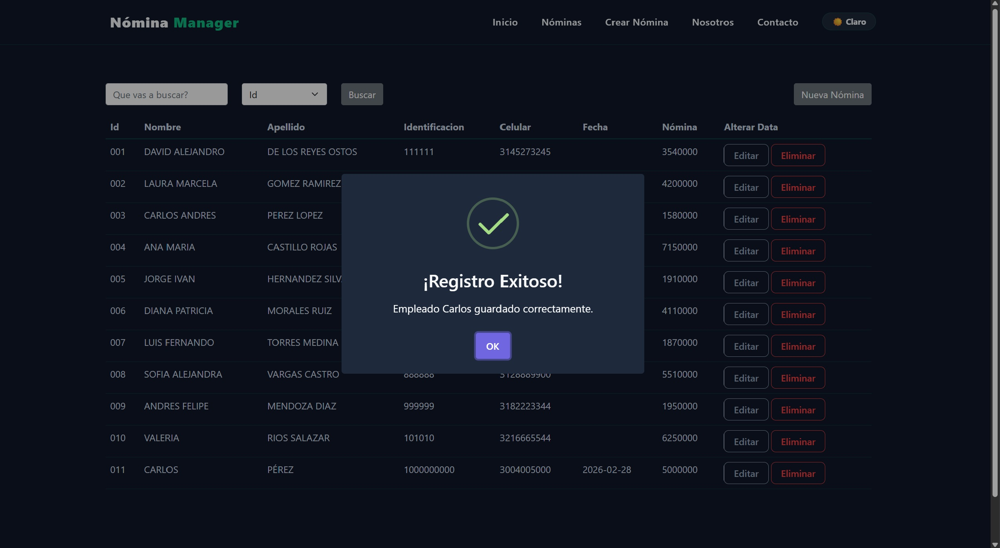
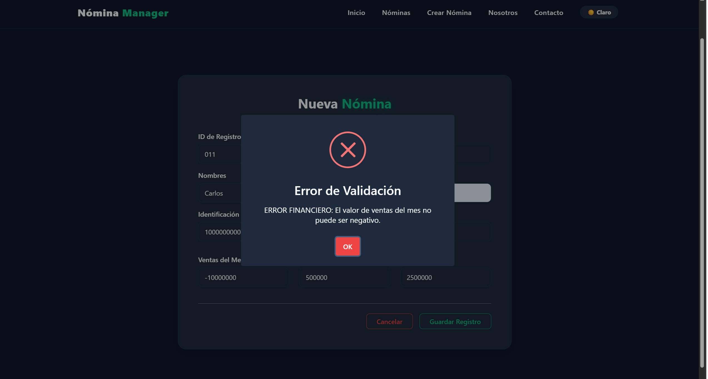

# 🏢 NominaManager (payroll manager) project -  Full Stack Architecture 


## 📋 Context & Contributions

This repository hosts the Full Stack codebase for **NominaManager**, a sales force and payroll management system initially developed as a foundational project during the **Misión TIC 2022** certification. The architecture demonstrates the integration of a robust Enterprise backend with a highly reactive, modernized frontend.

### 👨‍💻 My Contributions (David De Los Reyes - Full Stack Engineer)
As the lead developer refactoring this template, my specific contributions were:
* **Frontend Modernization (React):** Upgraded legacy code to support modern Node.js environments. Designed a custom UI/UX featuring *Glassmorphism*, *Neon Glow* effects, and a fully functional Dark/Light Mode toggle built over Bootstrap.
* **Backend Integration (Spring Boot):** Wrote the source code in java and connected the React SPA to the Java REST API using Axios, ensuring smooth asynchronous data fetching and state management.
* **Containerization (Docker):** Wrote the Dockerfiles and `docker-compose.yml` to orchestrate the entire Full Stack environment (Frontend, Backend, and MongoDB), resolving inter-container network routing.
* **Database Stability (MongoDB):** Configured dynamic environment variables to seamlessly switch between local and containerized MongoDB instances without hardcoding credentials.

---

## 🚀 System Overview

A CRUD-based management system developed with **React** (Frontend), **Java Spring Boot** (Backend), and **MongoDB** (Database). The project acts as a template for calculating payrolls, managing sales force metrics, and applying dynamic bonuses.

### ✨ Key Features
- **Modern UI/UX:** Responsive design with dynamic Dark/Light themes and custom CSS hover physics.
- **RESTful API:** Robust Java backend handling business logic and payroll calculations.
- **Advanced Data Persistence:** Utilizes Spring Data MongoDB for robust database interactions, implementing both auto-generated Derived Query Methods (`findBy...`) and custom native JSON queries (`@Query`) for complex data filtering.
- **Containerized Stack:** Fully Dockerized for "one-click" local deployment.
- **Single Page Application (SPA):** Instant navigation without page reloads using React Router DOM.

## 🖥️ User Interface (UI)

### Main Dashboard
*(Aquí puedes mostrar la pantalla central con el listado de empleados)*


### Payroll Registration
*(Interfaz para crear una nueva nómina)*


### Input Validation According to Bussines Rules
*(Interfaz para la gestión y actualización de datos)*


---

## ☁️ Deployment Readiness

While this repository is currently optimized for local containerized deployment via Docker Compose, the architecture is designed to be easily integrated into CI/CD pipelines (such as Azure DevOps or GitHub Actions) deploying to cloud services like Azure App Service or AWS ECS.

## 🛠️ Tech Stack

* **Frontend:** React.js, React Router DOM, Axios, Bootstrap (Custom CSS)
* **Backend:** Java 17, Spring Boot, Spring Data MongoDB
* **Database:** MongoDB
* **Containerization:** Docker & Docker Compose
* **Architecture:** REST API, MVC Pattern, SPA

## ⚙️ Local Installation & Setup

### 1. Clone the repository
```bash
git clone [https://github.com/Prado500/nomina-manager-template.git](https://github.com/Prado500/nomina-manager-template.git)
cd nomina-manager-template
```

## 2. Run with Docker (Recommended)

Ensure you have the Docker daemon running on your machine. This command will download the necessary images, build the Java and React projects, and orchestrate the network automatically.

```bash
docker-compose up -d --build
```

## 3. Access the Application

Once the containers are up and running, you can access the stack at:

**Frontend UI:** http://localhost:3000

**Backend API:** http://localhost:8080

**Database:** localhost:27017

## 👤 Employee Registration Boilerplate

To register a new employee/payroll via API testing tools (like Postman) or the Frontend UI, you can use this JSON template within the request body:

```JSON

{
 "id": "001",
"nombre": "David Alejandro",
"apellido": "De los reyes Ostos",
"telefono": "3145273245",
"identificacion": "111111",
"ventas": 4000000,
"prestaciones": 500000,
"salario": 3000000
}

```

## 📚 Main Endpoints

🔓 **Public API (CORS enabled for localhost:3000)**


| Method | Endpoint | Description |
| :--- | :--- | :--- |
| **GET** | `/empleado` | `Retrieve all employees and their current payroll status` |
| **POST** | `/empleado` | `Register a new employee into the MongoDB database` |
| **GET** | `/empleado/{id}` | `Retrieve a specific employee by their database ID` |
| **GET** | `/empleado/nombre/{nombre}` | `Search and filter employees by their exact first name` |
| **GET** | `/empleado/apellido/{apellido}` | `Search and filter employees by their exact last name` |
| **GET** | `/empleado/identificacion/{identificacion}` | `Search and filter employees by their ID number` |
| **DELETE** | `/empleado/{id}` | `Remove an employee record from the system` |

*(Note: The API currently supports creation, deletion, and advanced filtering. Employee updates are handled via re-entry).*

## 🔒 Architecture & Security

**CORS Configured:** The backend explicitly allows Cross-Origin Resource Sharing from the React frontend running on port 3000.

**Database Protection:** Connection URIs abstracted via environment variables. NoSQL Injection handled natively by Spring Data MongoDB repositories.

Full Stack Architecture modernized by David Alejandro De Los Reyes Ostos.
